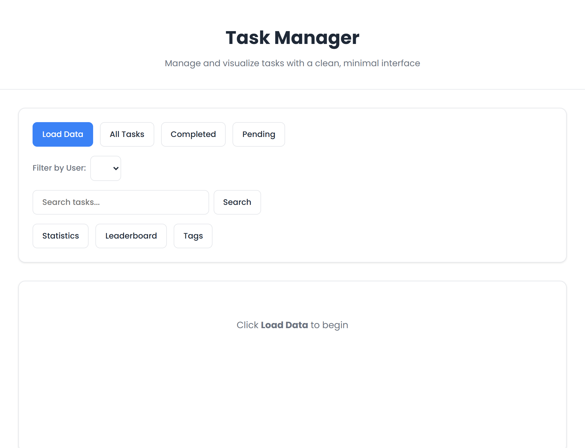
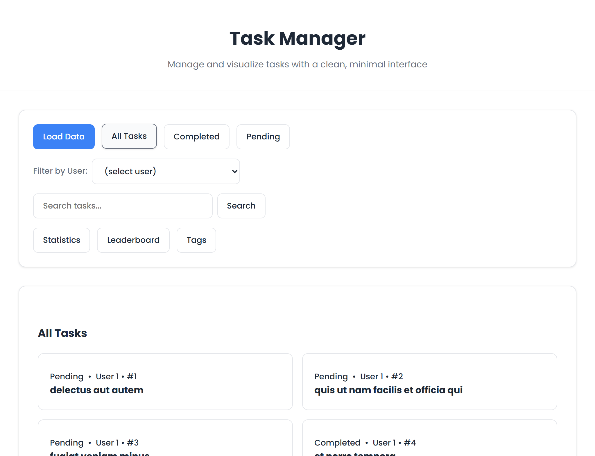
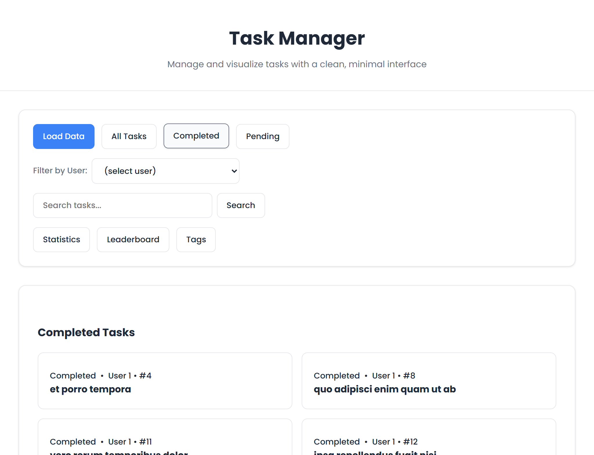
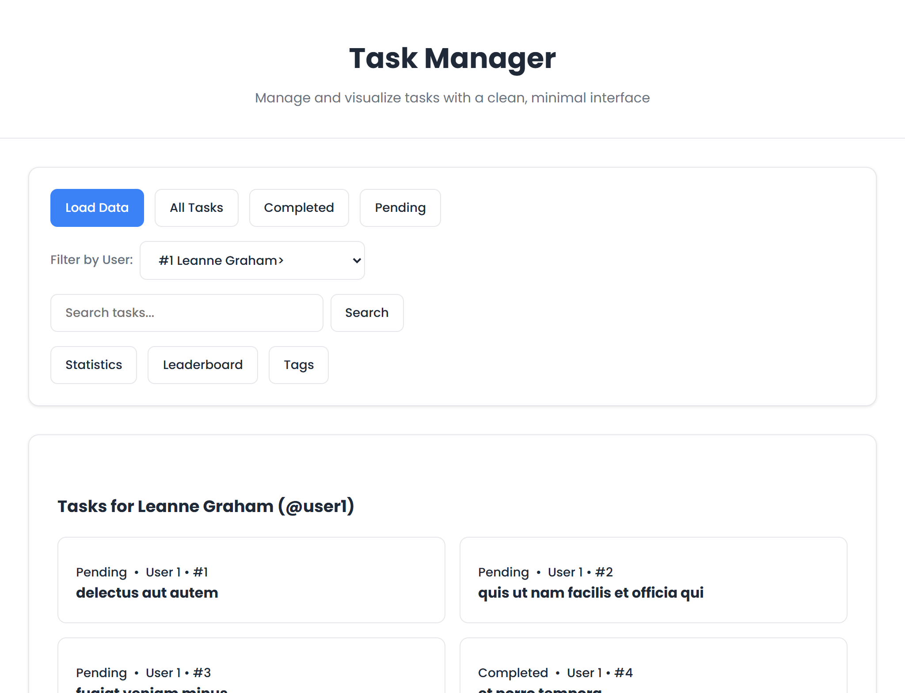
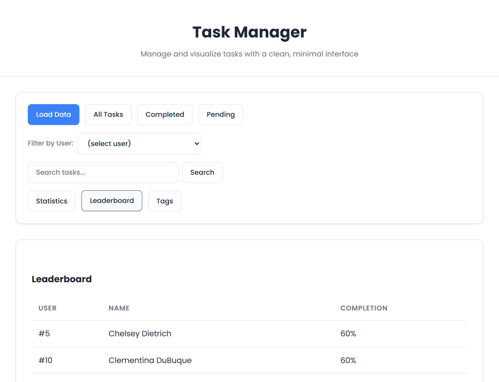
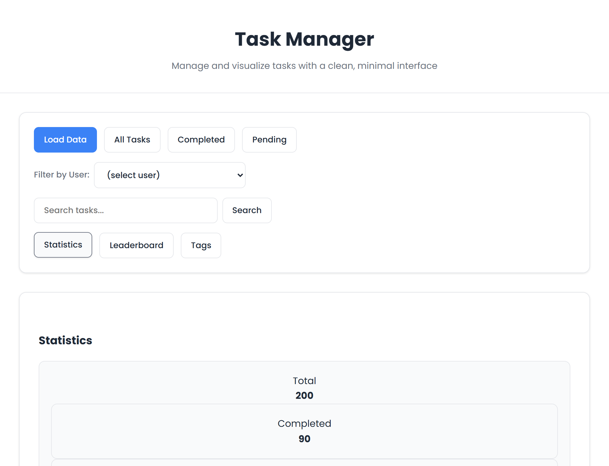

# Task Manager API Client

A lightweight JavaScript client for interacting with a task/todo API, featuring a simple CLI and browser UI.

## Features

- **API Client** (`src/api.js`) – Fetch users and todos with async/await or Promises
- **In-memory caching** – Built-in request cache with `clearCache()` method
- **CLI tool** (`src/cli.js`) – Command-line utilities for quick data inspection
- **Browser UI** (`index.html`) – Minimal demo interface (no dependencies)

## Quick Start

**Requirements:** Node.js v16+

```bash
# Install dependencies
npm install

# Run CLI
node src/cli.js [command]

# Serve browser UI or use a Liveserver extension
npx http-server . -p 8080
# Open http://localhost:8080
```

## Development

- **Source:** (`src/`) folder

- **Linting:** `eslint.config.mjs`

- Add build/test scripts to `package.json` as needed


## Screenshots


Task Manager UI



All Tasks


Completed Tasks


Pending Tasks


Filter by a user


Task Leaderboard


Statistics